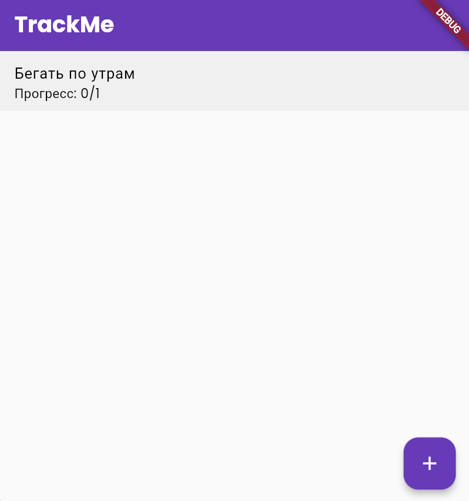
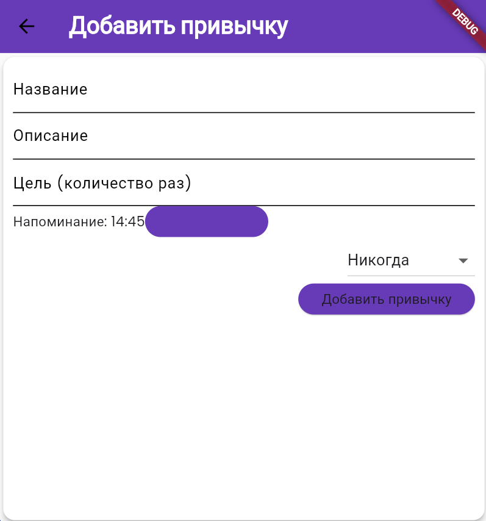
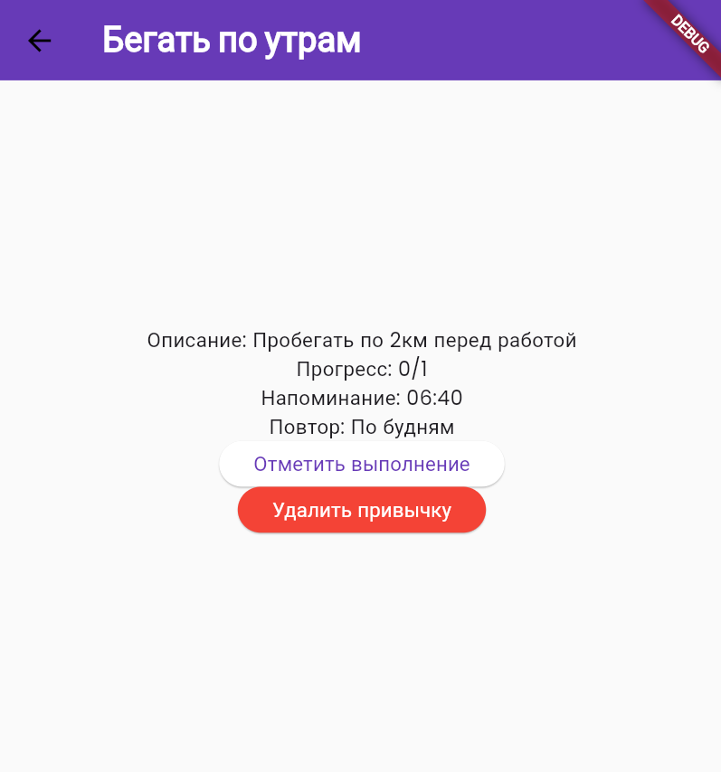

# TrackMe - приложение для Аврора ОС

## Описание

  TrackMe - это удобное и простое в использовании приложение, которое поможет вам формировать полезные привычки и отслеживать свой прогресс. Также приложение позволяет устанавливать индивидуальные цели и частоту выполнения. Вы можете добавлять напоминания, чтобы не пропускать важные задачи.

## Функциональность

- **Создание и управление привычками**  
  Добавляйте новые привычки и настраивайте детали.

- **Установка индивидуальных целей**  
  Задавайте цели для каждой привычки, например, количество выполнений в день/неделю/месяц.

- **Добавление напоминаний**  
  Устанавливайте уведомления, чтобы не пропускать выполнение привычек.

- **Мотивационные уведомления**  
  Получайте вдохновляющие сообщения и советы для поддержания мотивации.

- **Экспорт данных**  
  Сохраняйте свои результаты в виде файлов для дальнейшего анализа или печати.

## Команда разработчиков

-  pipizhdol
-  NightRider

## Технологии
-   **AvroraSDK** Плагин для разработки приложения для ОС Аврора.
-   **Flutter:** Кросс-платформенный фреймворк для разработки пользовательского интерфейса.
-   **Dart:** Язык программирования, используемый во Flutter.

### Используемые библиотеки и пакеты Flutter:

-  flutter_local_notifications
-  google_fonts
-  intl

## Галерея
|  
| 
|  
